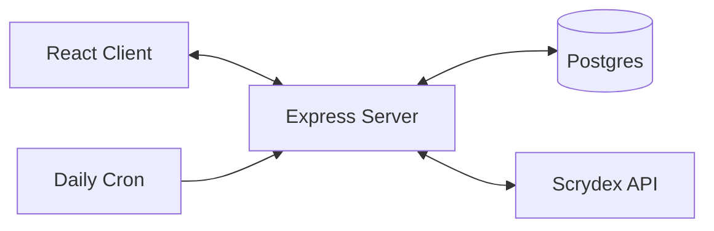
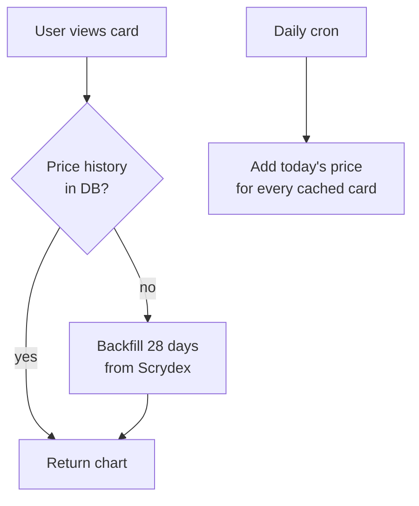

# Architecture

## Overview

- **Client** — React + Vite, talks to the server over REST
- **Server** — Express, handles auth, 3-tier cache, proxies the Scrydex API
- **Postgres** — stores users, portfolios, and price history
- **Scrydex** — external Pokémon TCG data + prices
- **Cron** — runs daily at 1 PM CT to record prices

## Price Flow

First view seeds the history; the cron grows it forever.
