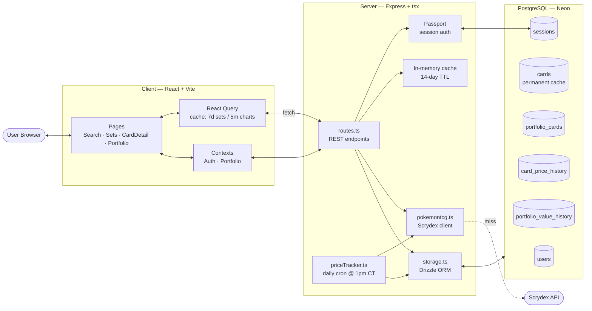
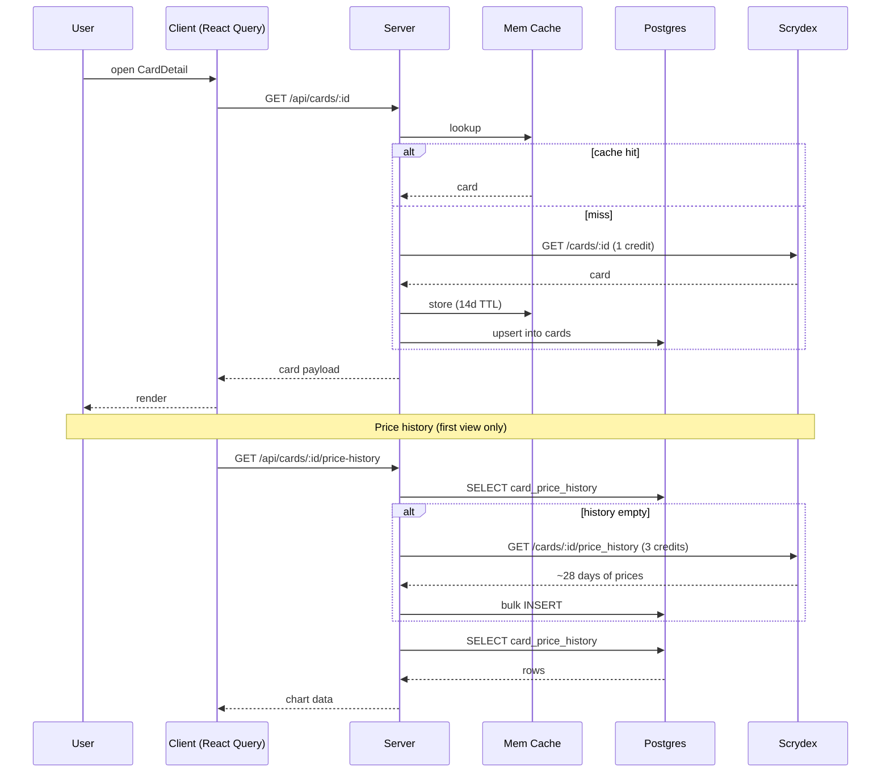
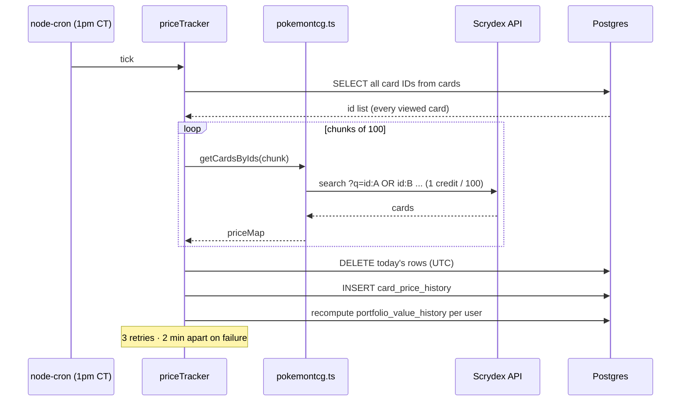
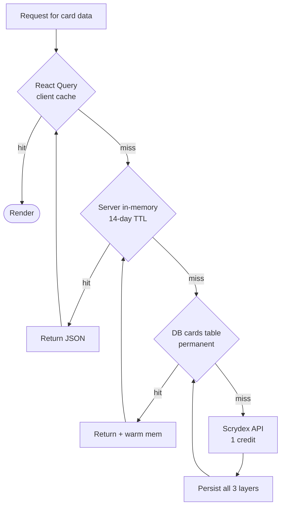
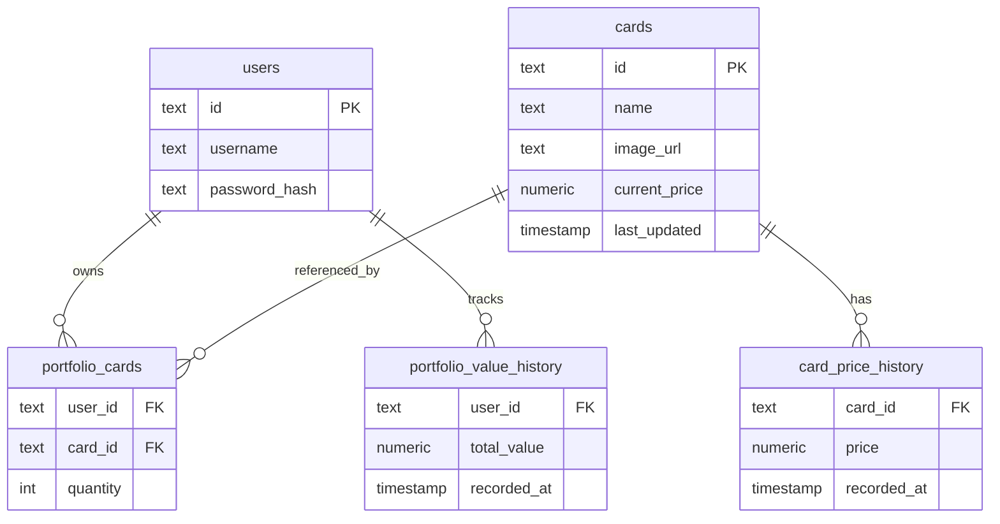

# Architecture

## System Overview

## Read Path — Viewing a Card

## Write Path — Daily Price Cron

## Caching Layers

| Layer | Where | TTL | Purpose |
| --- | --- | --- | --- |
| React Query | Browser | 7d sets / 5m charts | Avoid network on tab switch |
| In-memory `apiCache` | Express | 14 days | Avoid DB hit for set browsing |
| `cards` table | Postgres | Permanent | Avoid Scrydex on cold start |

## Data Model

## Key Design Decisions

- **Track every viewed card, not just portfolio cards.** Means switching a card in/out of the portfolio doesn't lose history, and new portfolio adds already have a chart.
- **Batch by 100, not one-by-one.** `getCardsByIds()` collapses 100 cards into a single Scrydex query (`id:A OR id:B ...`) — 1 credit instead of 100.
- **On-demand backfill, daily growth.** First viewer pays 3 credits to seed ~28 days; the cron extends it forever.
- **All timestamps UTC.** The cron's `America/Chicago` timezone only controls *when* it fires, not how dates are compared. (`date-fns-tz` had a midnight-boundary bug — removed.)
- **Shared schema.** `shared/schema.ts` exports Drizzle tables *and* Zod validators, consumed by both client and server — no type drift.
